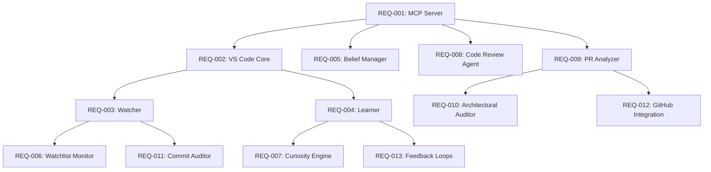

# Draagon Forge - Requirements Index

**Project:** Draagon Forge - AI Development Companion
**Status:** Initial Setup
**Last Updated:** 2026-01-13

---

## Overview

This directory contains functional requirement specifications for Draagon Forge, an AI Development Companion that provides intelligent, learning, proactive assistance throughout the software development lifecycle.

Each REQ document follows spec kit standards with:
- Clear acceptance criteria (testable)
- Constitution compliance checks
- Implementation estimates
- Integration points

---

## Requirements

### Phase 1: Foundation

| REQ ID | Feature | Priority | Complexity | Status |
|--------|---------|----------|------------|--------|
| [REQ-001](./REQ-001-mcp-context-server.md) | MCP Context Server | P0 | High | Planned |
| [REQ-002](./REQ-002-vscode-extension-core.md) | VS Code Extension Core | P0 | High | Planned |
| [REQ-003](./REQ-003-watcher-module.md) | Watcher Module | P0 | Medium | Planned |
| [REQ-004](./REQ-004-learner-module.md) | Learner Module | P0 | Medium | Planned |

### Phase 2: Intelligence

| REQ ID | Feature | Priority | Complexity | Status |
|--------|---------|----------|------------|--------|
| [REQ-005](./REQ-005-belief-manager.md) | Belief Manager | P1 | Medium | Planned |
| [REQ-006](./REQ-006-watchlist-monitor.md) | Watchlist & Real-Time Monitor | P1 | High | Planned |
| [REQ-007](./REQ-007-curiosity-engine.md) | Curiosity Engine | P1 | Medium | Planned |

### Phase 3: Agents

| REQ ID | Feature | Priority | Complexity | Status |
|--------|---------|----------|------------|--------|
| [REQ-008](./REQ-008-code-review-agent.md) | Code Review Agent | P1 | High | Planned |
| [REQ-009](./REQ-009-pr-analyzer-agent.md) | PR Analyzer Agent | P1 | High | Planned |
| [REQ-010](./REQ-010-architectural-auditor.md) | Architectural Auditor Agent | P2 | Very High | Planned |
| [REQ-011](./REQ-011-commit-auditor.md) | Developer Commit Auditor | P1 | High | Planned |

### Phase 4: Integration

| REQ ID | Feature | Priority | Complexity | Status |
|--------|---------|----------|------------|--------|
| [REQ-012](./REQ-012-github-integration.md) | GitHub Integration | P1 | High | Planned |
| [REQ-013](./REQ-013-feedback-loops.md) | Feedback Loops | P1 | Medium | Planned |

---

## Dependencies

**Critical Path:** REQ-001 → REQ-002 → REQ-003/REQ-004 → REQ-005/REQ-006

---

## Implementation Phases

### Phase 1: Foundation (Est. 20 days)
- **REQ-001**: MCP Context Server
- **REQ-002**: VS Code Extension Core
- **REQ-003**: Watcher Module
- **REQ-004**: Learner Module

### Phase 2: Intelligence (Est. 15 days)
- **REQ-005**: Belief Manager
- **REQ-006**: Watchlist & Real-Time Monitor
- **REQ-007**: Curiosity Engine

### Phase 3: Agents (Est. 15 days)
- **REQ-008**: Code Review Agent
- **REQ-009**: PR Analyzer Agent
- **REQ-010**: Architectural Auditor
- **REQ-011**: Commit Auditor

### Phase 4: Integration (Est. 10 days)
- **REQ-012**: GitHub Integration
- **REQ-013**: Feedback Loops

---

## Constitution Compliance Summary

All requirements validated against Draagon Forge constitution:

| Principle | REQ-001 | REQ-002 | REQ-003 | REQ-004 | REQ-005 |
|-----------|---------|---------|---------|---------|---------|
| LLM-First Architecture | ✅ | N/A | ✅ | ✅ | ✅ |
| XML Output Format | ✅ | N/A | ✅ | ✅ | ✅ |
| Protocol-Based Design | ✅ | ✅ | ✅ | ✅ | ✅ |
| Async-First Processing | ✅ | ✅ | ✅ | ✅ | ✅ |
| Test Outcomes | ✅ | ✅ | ✅ | ✅ | ✅ |

---

## Success Metrics

| Metric | Target | Primary REQ |
|--------|--------|-------------|
| Context Relevance | >85% | REQ-001 |
| Correction Detection | >90% | REQ-004 |
| Architectural Violations Caught | >80% | REQ-010 |
| PR Review Accuracy | >75% | REQ-009 |
| Learning Persistence | >70% | REQ-013 |
| Developer Adoption | >60% | REQ-002 |

---

**Document Status:** Active
**Maintainer:** Draagon Forge team
**Last Review:** 2026-01-13
