# Draagon Forge - Requirements Index

**Project:** Draagon Forge - AI Development Companion
**Status:** Initial Setup
**Last Updated:** 2026-01-13

---

## Overview

This directory contains functional requirement specifications for Draagon Forge, an AI Development Companion that provides intelligent, learning, proactive assistance throughout the software development lifecycle.

Each REQ document follows spec kit standards with:
- Clear acceptance criteria (testable)
- Constitution compliance checks
- Implementation estimates
- Integration points

---

## Three-Layer Architecture

Draagon Forge uses a layered architecture to enable reuse across domains:

```
┌─────────────────────────────────────────────────────────────────────────────┐
│                           LAYER 1: draagon-ai (Core)                         │
│  Memory, Beliefs, Agents, Behaviors, Orchestration, Learning                 │
└─────────────────────────────────────────────────────────────────────────────┘
                                      │
                                      ▼
┌─────────────────────────────────────────────────────────────────────────────┐
│                 LAYER 2: draagon-ai-forge (Generic Extensions)               │
│  MCP Integration, Multi-Model Routing, Behavior Evolution, Reflection        │
│  REQ-023, REQ-024, REQ-025, REQ-026, REQ-027 (partial), REQ-028, REQ-031     │
└─────────────────────────────────────────────────────────────────────────────┘
                    │                              │
                    ▼                              ▼
┌───────────────────────────────┐  ┌───────────────────────────────────────────┐
│ LAYER 3a: draagon-forge       │  │ LAYER 3b: draagon-forge-health (future)   │
│ (Programming Domain)          │  │ (Healthcare Domain)                       │
│ REQ-001-022, REQ-027.4,       │  │ analyze_diagnosis, check_protocols        │
│ REQ-029, REQ-030              │  │ Clinical behaviors, HIPAA compliance      │
└───────────────────────────────┘  └───────────────────────────────────────────┘
```

**Layer Key:**
- 🔷 **Layer 2 (Generic)**: Reusable across all domains
- 🟢 **Layer 3 (Domain)**: Programming-specific implementation

See [REQ-031: Extension Architecture](./REQ-031-extension-architecture.md) for details.

---

## Requirements

### Phase 1: Foundation

| REQ ID | Feature | Priority | Complexity | Status |
|--------|---------|----------|------------|--------|
| [REQ-001](./REQ-001-mcp-context-server.md) | MCP Context Server | P0 | High | Planned |
| [REQ-002](./REQ-002-vscode-extension-core.md) | VS Code Extension Core | P0 | High | Planned |
| [REQ-003](./REQ-003-watcher-module.md) | Watcher Module | P0 | Medium | Planned |
| [REQ-004](./REQ-004-learner-module.md) | Learner Module | P0 | Medium | Planned |

### Phase 2: Intelligence

| REQ ID | Feature | Priority | Complexity | Status |
|--------|---------|----------|------------|--------|
| [REQ-005](./REQ-005-belief-manager.md) | Belief Manager | P1 | Medium | Planned |
| [REQ-006](./REQ-006-watchlist-monitor.md) | Watchlist & Real-Time Monitor | P1 | High | Planned |
| [REQ-007](./REQ-007-curiosity-engine.md) | Curiosity Engine | P1 | Medium | Planned |

### Phase 3: Agents

| REQ ID | Feature | Priority | Complexity | Status |
|--------|---------|----------|------------|--------|
| [REQ-008](./REQ-008-code-review-agent.md) | Code Review Agent | P1 | High | Planned |
| [REQ-009](./REQ-009-pr-analyzer-agent.md) | PR Analyzer Agent | P1 | High | Planned |
| [REQ-010](./REQ-010-architectural-auditor.md) | Architectural Auditor Agent | P2 | Very High | Planned |
| [REQ-011](./REQ-011-commit-auditor.md) | Developer Commit Auditor | P1 | High | Planned |

### Phase 4: Integration

| REQ ID | Feature | Priority | Complexity | Status |
|--------|---------|----------|------------|--------|
| [REQ-012](./REQ-012-github-integration.md) | GitHub Integration | P1 | High | Planned |
| [REQ-013](./REQ-013-feedback-loops.md) | Feedback Loops | P1 | Medium | Planned |

### Phase 5: Context Engineering & Semantic Intelligence

> **Combines insights from:**
> - [Cursor's Dynamic Context Discovery](https://cursor.com/blog/dynamic-context-discovery) - Token reduction patterns
> - Context Engineering R&D Framework - Reduce & Delegate strategies
>
> **Key Innovation:** Unlike file-centric approaches (CLAUDE.md, bundle files, static primes),
> Draagon Forge uses **semantic memory** (Neo4j + Qdrant) for dynamic, learning, queryable context.

#### Phase 5a: Token Optimization (from Cursor)

| REQ ID | Feature | Priority | Complexity | Status |
|--------|---------|----------|------------|--------|
| [REQ-014](./REQ-014-dynamic-context-discovery.md) | Dynamic Context Discovery (Overview) | P0 | High | Planned |
| [REQ-015](./REQ-015-mcp-tool-lazy-loading.md) | MCP Tool Lazy Loading | P0 | Medium | Planned |
| [REQ-016](./REQ-016-conversation-history-search.md) | Conversation History Search | P1 | Low | Planned |
| [REQ-017](./REQ-017-adaptive-context-checking.md) | Adaptive Context Checking | P1 | Low | Planned |
| [REQ-018](./REQ-018-quality-aware-retrieval.md) | Quality-Aware Retrieval | P1 | Low | Planned |
| [REQ-019](./REQ-019-file-based-output-management.md) | File-Based Output Management | P2 | Medium | Planned |

#### Phase 5b: Semantic Context Management (R&D Framework Enhanced)

| REQ ID | Feature | Priority | Complexity | Status |
|--------|---------|----------|------------|--------|
| [REQ-020](./REQ-020-semantic-context-bundles.md) | Semantic Context Bundles | P1 | Medium | Planned |
| [REQ-021](./REQ-021-dynamic-context-priming.md) | Dynamic Context Priming | P1 | Medium | Planned |
| [REQ-022](./REQ-022-cross-agent-semantic-memory.md) | Cross-Agent Semantic Memory | P1 | Medium | Planned |

### Phase 6: Self-Improvement & Multi-Agent Intelligence

> **Key Innovation:** Beyond static agents, Draagon Forge enables **self-improving behaviors** and
> **cognitive swarms** that create new capabilities through conversation, evolve prompts through
> genetic algorithms, and learn collectively from outcomes.
>
> **Derived from:** [draagon-ai BEHAVIOR_SYSTEM_DESIGN.md](../../draagon-ai/docs/design/BEHAVIOR_SYSTEM_DESIGN.md)
> and [COGNITIVE_SWARM_ARCHITECTURE.md](../../draagon-ai/docs/specs/COGNITIVE_SWARM_ARCHITECTURE.md)

| REQ ID | Feature | Priority | Complexity | Layer | Status |
|--------|---------|----------|------------|-------|--------|
| [REQ-023](./REQ-023-behavior-architect.md) | Behavior Architect | P0 | Very High | 🔷 L2 | Planned |
| [REQ-024](./REQ-024-behavior-evolution.md) | Behavior Evolution | P1 | High | 🔷 L2 | Planned |
| [REQ-025](./REQ-025-cognitive-swarm.md) | Cognitive Swarm Orchestration | P1 | High | 🔷 L2 | Planned |
| [REQ-026](./REQ-026-metacognitive-reflection.md) | Metacognitive Reflection | P1 | Medium | 🔷 L2 | Planned |
| [REQ-027](./REQ-027-claude-code-integration.md) | Claude Code Integration | P0 | High | 🔷/🟢 | Planned |
| [REQ-028](./REQ-028-multi-model-cost-optimization.md) | Multi-Model Cost Optimization | P0 | Medium | 🔷 L2 | Planned |
| [REQ-031](./REQ-031-extension-architecture.md) | Extension Architecture | P0 | Medium | 🔷 L2 | Planned |

**Layer Key:** 🔷 L2 = Generic (draagon-ai-forge), 🟢 L3 = Programming-specific, 🔷/🟢 = Split

**Key Capabilities:**

| Capability | Description | Differentiator |
|------------|-------------|----------------|
| **Behavior Architect** | Create agents through natural conversation | No code required, iterative refinement |
| **Behavior Evolution** | Self-improving prompts via genetic algorithms | Learns from outcomes automatically |
| **Cognitive Swarm** | Multi-agent coordination with shared memory | Parallel execution, belief reconciliation |
| **Metacognitive Reflection** | Automatic post-task learning | Patterns extracted, expertise updated |
| **Claude Code Integration** | Bridge Claude subagents/skills with draagon-ai | Hybrid intelligence, feedback loops |
| **Multi-Model Cost Optimization** | Tiered LLM routing (Groq → Sonnet → Opus) | ~90% cost reduction, quality preserved |
| **Extension Architecture** | Three-layer design for domain reuse | Healthcare, legal, etc. can reuse core |

### Phase 7: Sidebar, Inspector & Knowledge Ecosystem

> **Key Innovation:** Real-time visibility into Forge operations, comprehensive account management,
> and automated knowledge ingestion from GitHub repositories and project documentation.
>
> **Focus:** Developer experience, transparency, and bootstrapping the knowledge base.

| REQ ID | Feature | Priority | Complexity | Status |
|--------|---------|----------|------------|--------|
| [REQ-029](./REQ-029-account-knowledge-ecosystem.md) | Account & Knowledge Ecosystem | P0-P2 | Medium-High | **Planned** |
| [REQ-030](./REQ-030-sidebar-inspector.md) | Sidebar & Real-Time Inspector | P0-P1 | Medium | **Phase 1-2 Implemented** |

**Key Capabilities:**

| Capability | Description | Differentiator |
|------------|-------------|----------------|
| **Real-Time Inspector** | WebSocket-based event streaming of MCP calls | See exactly what Forge is doing |
| **Memory Browser** | Tree view of beliefs, insights, skills | Browse and manage semantic memory |
| **Account Display** | Claude account + Forge identity | Trust and transparency |
| **Usage Tracking** | Token consumption per model, session costs | Cost awareness |
| **Knowledge Import** | Import CLAUDE.md, docs as beliefs | Bootstrap knowledge base |
| **GitHub Monitoring** | Track repos, auto-sync on changes | Killer feature for learning |
| **Multi-Account** | Switch between personal/org accounts | Team/enterprise support |

---

## The Semantic Advantage

Traditional context engineering uses **files**. Draagon Forge uses **semantic memory**:

| Pattern | File-Centric | Draagon Semantic |
|---------|--------------|------------------|
| **Context Bundles** | Append ops to .md file | Store as episodic memories with relationships |
| **Priming** | Load static `/prime-*.md` | Query beliefs/patterns by task type dynamically |
| **Agent Reports** | Write to report.md | Publish to shared semantic memory |
| **Expertise** | Manual agent configs | TransactiveMemory tracks success automatically |
| **Decisions** | Scattered in files | Shared decision registry, queryable |
| **Learning** | Manual CLAUDE.md updates | Findings reconcile to beliefs automatically |

**Benefits:**
- Context evolves as beliefs strengthen/weaken
- Cross-session learning (patterns persist)
- Automatic relevance filtering (no manual cleanup)
- Expertise routing (best agent selected automatically)
- Conflict detection (contradicting findings flagged)

---

## Dependencies

```mermaid
graph TD
    REQ001[REQ-001: MCP Server] --> REQ002[REQ-002: VS Code Core]
    REQ002 --> REQ003[REQ-003: Watcher]
    REQ002 --> REQ004[REQ-004: Learner]
    REQ001 --> REQ005[REQ-005: Belief Manager]
    REQ003 --> REQ006[REQ-006: Watchlist Monitor]
    REQ004 --> REQ007[REQ-007: Curiosity Engine]
    REQ001 --> REQ008[REQ-008: Code Review Agent]
    REQ001 --> REQ009[REQ-009: PR Analyzer]
    REQ009 --> REQ010[REQ-010: Architectural Auditor]
    REQ003 --> REQ011[REQ-011: Commit Auditor]
    REQ009 --> REQ012[REQ-012: GitHub Integration]
    REQ004 --> REQ013[REQ-013: Feedback Loops]

    %% Phase 5a: Token Optimization
    REQ001 --> REQ014[REQ-014: Dynamic Context Discovery]
    REQ014 --> REQ015[REQ-015: Tool Lazy Loading]
    REQ014 --> REQ016[REQ-016: Conversation History]
    REQ014 --> REQ017[REQ-017: Adaptive Context]
    REQ014 --> REQ018[REQ-018: Quality Retrieval]
    REQ014 --> REQ019[REQ-019: File Outputs]

    %% Phase 5b: Semantic Context
    REQ016 --> REQ020[REQ-020: Semantic Bundles]
    REQ018 --> REQ021[REQ-021: Dynamic Priming]
    REQ020 --> REQ022[REQ-022: Cross-Agent Memory]
    REQ021 --> REQ022

    %% Phase 6: Self-Improvement & Multi-Agent
    REQ001 --> REQ023[REQ-023: Behavior Architect]
    REQ022 --> REQ023
    REQ023 --> REQ024[REQ-024: Behavior Evolution]
    REQ022 --> REQ025[REQ-025: Cognitive Swarm]
    REQ023 --> REQ025
    REQ001 --> REQ026[REQ-026: Metacognitive Reflection]
    REQ022 --> REQ026

    %% Claude Code Integration (bridges everything)
    REQ001 --> REQ027[REQ-027: Claude Code Integration]
    REQ022 --> REQ027
    REQ023 --> REQ027

    %% Multi-Model Cost Optimization
    REQ001 --> REQ028[REQ-028: Multi-Model Cost Optimization]
    REQ027 --> REQ028

    %% Phase 7: Sidebar & Knowledge Ecosystem
    REQ002 --> REQ030[REQ-030: Sidebar & Inspector]
    REQ001 --> REQ030
    REQ030 --> REQ029[REQ-029: Account & Knowledge]
    REQ012 --> REQ029

    %% Extension Architecture (foundational for multi-domain)
    REQ001 --> REQ031[REQ-031: Extension Architecture]
    REQ023 --> REQ031
    REQ028 --> REQ031

    style REQ014 fill:#f9f,stroke:#333,stroke-width:2px
    style REQ015 fill:#bbf,stroke:#333
    style REQ016 fill:#bbf,stroke:#333
    style REQ017 fill:#bbf,stroke:#333
    style REQ018 fill:#bbf,stroke:#333
    style REQ019 fill:#bbf,stroke:#333
    style REQ020 fill:#bfb,stroke:#333
    style REQ021 fill:#bfb,stroke:#333
    style REQ022 fill:#bfb,stroke:#333
    style REQ023 fill:#fbb,stroke:#333,stroke-width:2px
    style REQ024 fill:#fbb,stroke:#333
    style REQ025 fill:#fbb,stroke:#333
    style REQ026 fill:#fbb,stroke:#333
    style REQ027 fill:#fbf,stroke:#333,stroke-width:2px
    style REQ028 fill:#ff9,stroke:#333,stroke-width:2px
    style REQ029 fill:#9ff,stroke:#333,stroke-width:2px
    style REQ030 fill:#9ff,stroke:#333
    style REQ031 fill:#fcf,stroke:#333,stroke-width:2px
```



**Critical Path:** REQ-001 → REQ-002 → REQ-003/REQ-004 → REQ-005/REQ-006

**Phase 5a Path:** REQ-001 → REQ-014 → REQ-015/REQ-016/REQ-017/REQ-018/REQ-019

**Phase 5b Path:** REQ-016 → REQ-020 → REQ-022; REQ-018 → REQ-021 → REQ-022

**Phase 6 Path:** REQ-001 + REQ-022 → REQ-023 → REQ-024/REQ-025; REQ-022 → REQ-026

**Integration Path:** REQ-001 + REQ-022 + REQ-023 → REQ-027 (Claude Code Bridge)

**Phase 7 Path:** REQ-001 + REQ-002 → REQ-030 → REQ-029 (Sidebar → Knowledge Ecosystem)

---

## Implementation Phases

### Phase 1: Foundation (Est. 20 days)
- **REQ-001**: MCP Context Server
- **REQ-002**: VS Code Extension Core
- **REQ-003**: Watcher Module
- **REQ-004**: Learner Module

### Phase 2: Intelligence (Est. 15 days)
- **REQ-005**: Belief Manager
- **REQ-006**: Watchlist & Real-Time Monitor
- **REQ-007**: Curiosity Engine

### Phase 3: Agents (Est. 15 days)
- **REQ-008**: Code Review Agent
- **REQ-009**: PR Analyzer Agent
- **REQ-010**: Architectural Auditor
- **REQ-011**: Commit Auditor

### Phase 4: Integration (Est. 10 days)
- **REQ-012**: GitHub Integration
- **REQ-013**: Feedback Loops

### Phase 5: Context Engineering (Est. 31 days)

> **Key Insight:** Most capabilities already exist in draagon-ai. This phase is primarily
> about exposing existing functionality through MCP tools and adding semantic enhancements.

#### Phase 5a: Token Optimization (17 days)

| Sub-phase | Requirements | Effort | Focus |
|-----------|--------------|--------|-------|
| 5a.1: Foundation | REQ-015, REQ-016 | 8 days | Token reduction, history search |
| 5a.2: Intelligence | REQ-017, REQ-018 | 6 days | Adaptive processing, quality |
| 5a.3: Output Mgmt | REQ-019 | 3 days | File-based outputs |

#### Phase 5b: Semantic Enhancement (14 days)

| Sub-phase | Requirements | Effort | Focus |
|-----------|--------------|--------|-------|
| 5b.1: Bundles | REQ-020 | 5 days | Episodic operation capture, session replay |
| 5b.2: Priming | REQ-021 | 4 days | Dynamic context assembly, success weighting |
| 5b.3: Multi-Agent | REQ-022 | 5 days | Finding publication, expertise routing |

### Phase 6: Self-Improvement & Multi-Agent (Est. 58 days)

> **Key Innovation:** This phase makes Draagon Forge **self-improving**. Unlike static AI tools,
> behaviors evolve based on outcomes and new capabilities can be created through conversation.
> **Claude Code Integration** bridges the gap between Claude's native capabilities and draagon-ai's
> sophisticated agent system. **Multi-Model Cost Optimization** ensures intelligent tasks use
> appropriate models to minimize costs. **Extension Architecture** enables reuse across domains.

| Sub-phase | Requirements | Effort | Focus |
|-----------|--------------|--------|-------|
| 6.1: Behavior Architect | REQ-023 | 12 days | Create agents via conversation |
| 6.2: Evolution | REQ-024 | 8 days | Self-improving prompts |
| 6.3: Cognitive Swarm | REQ-025 | 10 days | Multi-agent coordination |
| 6.4: Reflection | REQ-026 | 5 days | Automatic post-task learning |
| 6.5: Claude Integration | REQ-027 | 12 days | Bridge Claude subagents/skills with draagon-ai |
| 6.6: Cost Optimization | REQ-028 | 6 days | Tiered LLM routing (Groq → Sonnet → Opus) |
| 6.7: Extension Architecture | REQ-031 | 5 days | Three-layer design for domain reuse |

**Expected Outcomes:**
- Create new agents through natural conversation
- Behaviors improve automatically with use (>20% improvement over time)
- Multi-agent tasks complete faster than sequential (>40% speedup)
- Automatic learning extraction (>70% of insights captured)
- Hybrid Claude/draagon-ai agents with expertise routing (>75% accuracy)
- Feedback loops close within 5 seconds
- ~90% cost reduction via intelligent model routing
- Reusable generic layer for healthcare, legal, and other domains

### Phase 7: Sidebar & Knowledge Ecosystem (Est. 25 days)

> **Key Innovation:** Complete developer experience with real-time visibility into Forge operations,
> knowledge bootstrapping from existing documentation and GitHub repositories.

| Sub-phase | Requirements | Effort | Focus |
|-----------|--------------|--------|-------|
| 7.1: Inspector & Memory | REQ-030 (Phase 1-2) | 5 days | Real-time events, memory browser |
| 7.2: Behavior Views | REQ-030 (Phase 3-4) | 5 days | Behavior registry, agent monitor |
| 7.3: Account & Usage | REQ-029 (Phase 1-2) | 5 days | Account display, token tracking |
| 7.4: Knowledge Import | REQ-029 (Phase 3) | 4 days | CLAUDE.md parsing, doc ingestion |
| 7.5: GitHub Monitoring | REQ-029 (Phase 4) | 6 days | Repo tracking, auto-sync |

**Expected Outcomes:**
- Real-time visibility into all MCP tool calls
- Browse and manage beliefs/insights via tree view
- See Claude account status and Forge identity
- Track token usage and estimated costs
- Bootstrap knowledge from CLAUDE.md files
- Auto-learn from tracked GitHub repositories

#### Phase 5 Expected Outcomes:
- ~47% reduction in MCP token usage
- Improved context relevance (>85%)
- Automatic session reconstruction
- Cross-agent knowledge sharing
- Learning from outcomes

---

## Constitution Compliance Summary

All requirements validated against Draagon Forge constitution:

| Principle | REQ-001 | REQ-002 | REQ-003 | REQ-004 | REQ-005 | REQ-014-022 |
|-----------|---------|---------|---------|---------|---------|-------------|
| LLM-First Architecture | ✅ | N/A | ✅ | ✅ | ✅ | ✅ |
| XML Output Format | ✅ | N/A | ✅ | ✅ | ✅ | ✅ |
| Protocol-Based Design | ✅ | ✅ | ✅ | ✅ | ✅ | ✅ |
| Async-First Processing | ✅ | ✅ | ✅ | ✅ | ✅ | ✅ |
| Test Outcomes | ✅ | ✅ | ✅ | ✅ | ✅ | ✅ |

---

## Success Metrics

| Metric | Target | Primary REQ |
|--------|--------|-------------|
| Context Relevance | >85% | REQ-001, REQ-018, REQ-021 |
| Correction Detection | >90% | REQ-004 |
| Architectural Violations Caught | >80% | REQ-010 |
| PR Review Accuracy | >75% | REQ-009 |
| Learning Persistence | >70% | REQ-013, REQ-020 |
| Developer Adoption | >60% | REQ-002 |
| **Token Usage Reduction** | **>40%** | **REQ-015** |
| **Retrieval Quality Score** | **>0.8** | **REQ-018** |
| **Adaptive Skip Rate** | **>50%** | **REQ-017** |
| **Session Reconstruction Accuracy** | **>70%** | **REQ-020** |
| **Cross-Agent Discovery Rate** | **>80%** | **REQ-022** |
| **Expertise Routing Accuracy** | **>75%** | **REQ-022** |
| **Behavior Creation Success** | **>80%** | **REQ-023** |
| **Prompt Evolution Improvement** | **>20%** | **REQ-024** |
| **Swarm Speedup vs Sequential** | **>40%** | **REQ-025** |
| **Learning Extraction Rate** | **>70%** | **REQ-026** |
| **Cost Reduction vs Baseline** | **>80%** | **REQ-028** |
| **FAST Tier Usage Rate** | **>70%** | **REQ-028** |
| **Escalation Rate** | **<20%** | **REQ-028** |
| **Inspector Event Latency** | **<100ms** | **REQ-030** |
| **Memory Browser Refresh** | **<500ms** | **REQ-030** |
| **Knowledge Import Accuracy** | **>85%** | **REQ-029** |
| **GitHub Sync Success Rate** | **>95%** | **REQ-029** |
| **Domain Onboarding Time** | **<1 day** | **REQ-031** |
| **Layer 2 Code Reuse** | **>70%** | **REQ-031** |

---

## draagon-ai Integration Matrix

**Key Principle:** Use draagon-ai models directly, don't reinvent.

### Core Models (USE DIRECTLY)

| draagon-ai Model | Location | Draagon Forge Usage |
|------------------|----------|---------------------|
| `Memory` | `memory/base.py` | Base storage unit |
| `MemoryType` | `memory/base.py` | FACT, BELIEF, OBSERVATION, INSIGHT, SKILL |
| `MemoryScope` | `memory/base.py` | WORLD, CONTEXT, AGENT, SESSION |
| `AgentBelief` | `core/types.py` | Belief with confidence |
| `BeliefType` | `core/types.py` | Extend with PRINCIPLE, PATTERN, LEARNING |
| `UserObservation` | `core/types.py` | Raw input before reconciliation |
| `SharedObservation` | `orchestration/shared_memory.py` | Multi-agent observations |
| `SharedWorkingMemory` | `orchestration/shared_memory.py` | Multi-agent coordination |
| `TransactiveMemory` | `orchestration/transactive_memory.py` | Expertise tracking |
| `ExpertiseEntry` | `orchestration/transactive_memory.py` | Agent expertise scores |
| `Learning` | `orchestration/learning_channel.py` | Cross-agent learnings |
| `LearningChannel` | `orchestration/learning_channel.py` | Pub/sub for learnings |
| `MemoryProvider` | `memory/providers/` | Storage backend (Neo4j) |

### REQ → draagon-ai Mapping

| Requirement | draagon-ai Component | Integration Type |
|-------------|---------------------|------------------|
| REQ-001 | `Memory`, `AgentBelief`, `MemoryProvider` | Wrap with MCP tools |
| REQ-005 | `AgentBelief`, `BeliefType` | UI layer on REQ-001 |
| REQ-015 | `tools/decorator.py` ToolRegistry | Expose via MCP |
| REQ-016 | `memory/base.py` MemoryType.EPISODIC | Expose via MCP |
| REQ-017 | `orchestration/loop.py` _check_if_expansion_needed | Expose via MCP |
| REQ-018 | `retrieval/retriever.py` HybridRetriever | Expose via MCP |
| REQ-019 | N/A | New implementation |
| REQ-020 | `Memory` with `MemoryType.EPISODIC` | Wrap with MCP tools |
| REQ-021 | `memory/base.py` search + `retrieval/` | Compose & expose |
| REQ-022 | `SharedObservation`, `TransactiveMemory` | Wrap with MCP tools |
| REQ-023 | `docs/design/BEHAVIOR_SYSTEM_DESIGN.md` | Implement from design |
| REQ-024 | `docs/design/BEHAVIOR_SYSTEM_DESIGN.md` | Implement from design |
| REQ-025 | `SharedWorkingMemory`, `TransactiveMemory` | Extend & wrap |
| REQ-026 | `Learning`, `LearningChannel`, `TransactiveMemory` | Wrap with MCP tools |
| REQ-027 | `Agent`, `Behavior`, `BehaviorRegistry`, `MultiAgent` | Bridge to Claude Code |
| REQ-028 | `llm/providers/`, `llm/router.py` | New implementation for model routing |
| REQ-029 | `IdentityManager`, `HierarchicalScope`, `DocumentIngestionOrchestrator` | Account/knowledge ecosystem |
| REQ-030 | `EventBus`, `MemoryProvider` | Sidebar/inspector UI |
| REQ-031 | `DomainRegistry`, `BaseMCPToolProvider` | Layer 2 architecture |

### Draagon Forge Extensions (New)

| Extension | Purpose | Base Model |
|-----------|---------|------------|
| `conviction: float` | Reinforcement score | Extends `AgentBelief` |
| `ForgeBeliefType.PRINCIPLE` | Architectural rules | Extends `BeliefType` |
| `ForgeBeliefType.PATTERN` | Code examples | Extends `BeliefType` |
| `ForgeBeliefType.LEARNING` | Extracted insights | Extends `BeliefType` |
| `TaskScopedWorkingMemory` | Task scoping | Extends `SharedWorkingMemory` |

---

## R&D Framework Summary

From the Context Engineering framework, every technique fits into **Reduce** or **Delegate**:

### Reduce (R) - Minimize tokens in primary context

| Technique | REQ | Description |
|-----------|-----|-------------|
| Lazy MCP Loading | REQ-015 | Load tool descriptions on-demand |
| Adaptive Context | REQ-017 | Skip retrieval for simple queries |
| Quality Filtering | REQ-018 | Only include relevant results |
| Dynamic Priming | REQ-021 | Query-based vs static files |

### Delegate (D) - Offload to other contexts

| Technique | REQ | Description |
|-----------|-----|-------------|
| File Outputs | REQ-019 | Large outputs to files for inspection |
| Session Bundles | REQ-020 | Delegate history to semantic memory |
| Cross-Agent Memory | REQ-022 | Delegate findings to shared memory |
| Expertise Routing | REQ-022 | Delegate tasks to best agent |

---

## References

- [Cursor: Dynamic Context Discovery](https://cursor.com/blog/dynamic-context-discovery)
- [Context Engineering: R&D Framework](TAC Course)
- [draagon-ai Documentation](../draagon-ai/docs/)
- [MCP Specification](https://modelcontextprotocol.io/docs)
- [CRAG Paper](https://arxiv.org/abs/2401.15884)

---

**Document Status:** Active
**Maintainer:** Draagon Forge team
**Last Review:** 2026-01-13
**Last Updated:** 2026-01-13 (Added Phase 7: REQ-029, REQ-030)
